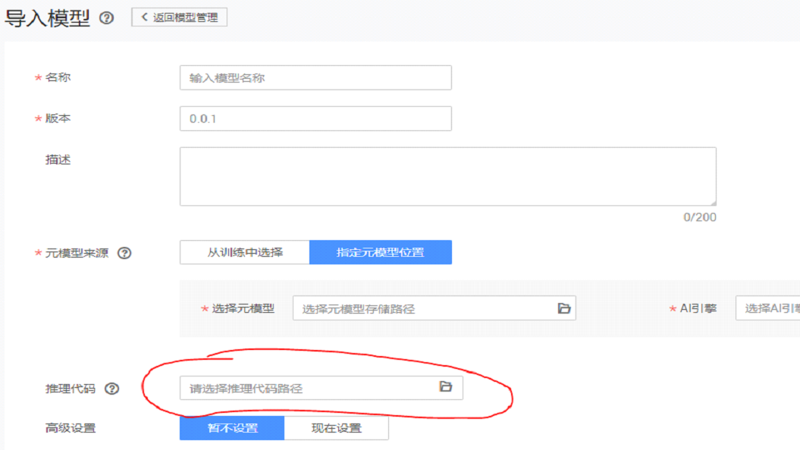

## 导入模型
从训练中选择、指定元模型位置两种方式均需要填写推理代码位置

* 图像分类用推理代码：
   https://github.com/huawei-clouds/modelarts-mxnet/blob/master/code/predict/cnn/dls_classification_service.py

​       修改变量`top_k=5`控制输出类别个数，**该值应小于总类别数**

* 物体检测用推理代码：
  https://github.com/huawei-clouds/modelarts-mxnet/blob/master/code/predict/object_detection/dls_faster_rcnn_service.py
  修改变量`NUM_CLASSES=21`控制检测物体类别数

## 模型部署
部署预测服务时需要添加环境变量input_data_name=images

## 已发布模型

1. mx_coccidia_faster_rcnn		

   类型：物体检测
   网络：faster_rcnn_resnet_v2_101
   引擎：mxnet
   数据集：犬球虫病寄生虫识别，https://www.kaggle.com/kvinicki/canine-coccidiosis
   精度：96%（map）
   类别：0-背景 
   ​          1-犬球虫病寄生虫
   预测服务环境变量：input_data_name=images

2. mx_flower_squeezenet	
   类型：图片分类
   网络：squeezene
   引擎：mxnet 
   数据集：花朵分类，http://download.tensorflow.org/example_images/flower_photos.tgz 
   精度：84%（top1）
   类别：0-雏菊
   ​            1-蒲公英
   ​            2-玫瑰
   ​            3-向日葵
   ​            4-郁金香
   预测服务环境变量：input_data_name=images

3. mx_monkey_resnet

   类型：图片分类 
   网络：resnet 
   引擎：mxnet 
   数据集：猴子分类，https://www.kaggle.com/slothkong/10-monkey-species/home 
   精度：85%（top1）
   类别：0- alouatta palliata 
   ​            1- erythrocebus patas
   ​            2- cacajao calvus
   ​            3- macaca fuscata
   ​            4- cebuella pygmea
   ​            5- cebus capucinus
   ​            6- mico argentatus
   ​            7- saimiri sciureus
   ​            8- aotus nigriceps
   ​            9- trachypithecus johnii
   预测服务环境变量：input_data_name=images

4. mx_caltech256_inception

   类型：图片分类 
   网络：inception-bn 
   引擎：mxnet 
   数据集：caltech256物体分类数据集，http://www.vision.caltech.edu/Image_Datasets/Caltech256/ 
   精度：80%（top1）
   类别：256种类别，详见http://www.vision.caltech.edu/Image_Datasets/Caltech256/images/
   预测服务环境变量：input_data_name=images

5. mx_dogcat_resnext

   类型：图片分类 
   网络：resnext 
   引擎：mxnet 
   数据集：猫狗分类，https://www.kaggle.com/tongpython/cat-and-dog 
   精度：98%（top1）
   类别：0-猫 
   ​           1-狗
   预测服务环境变量：input_data_name=images